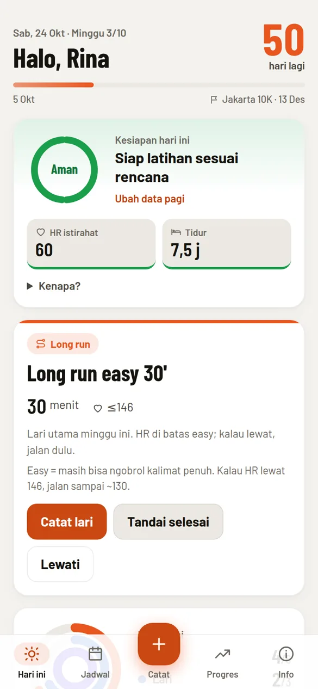
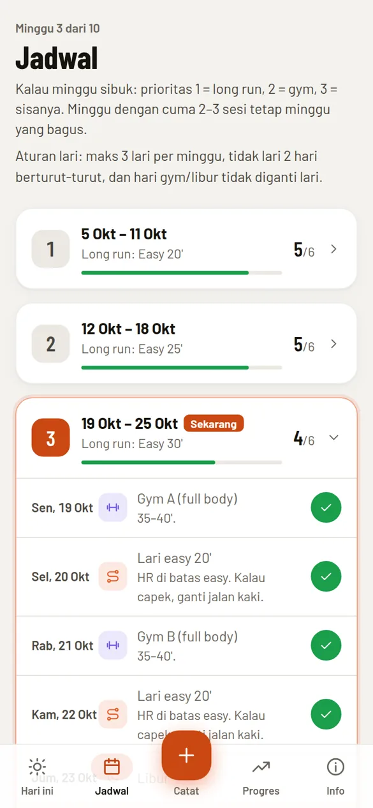
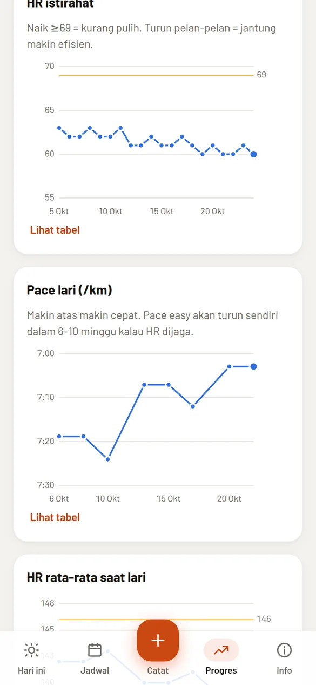
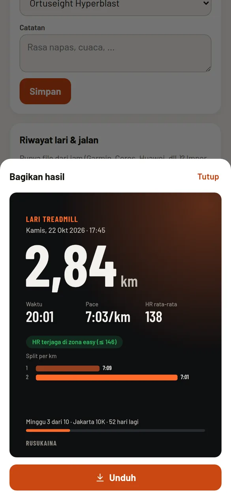
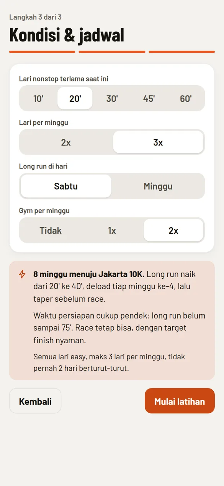
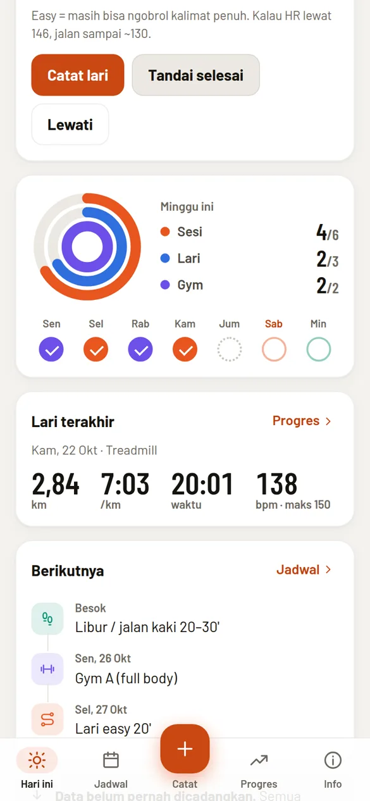
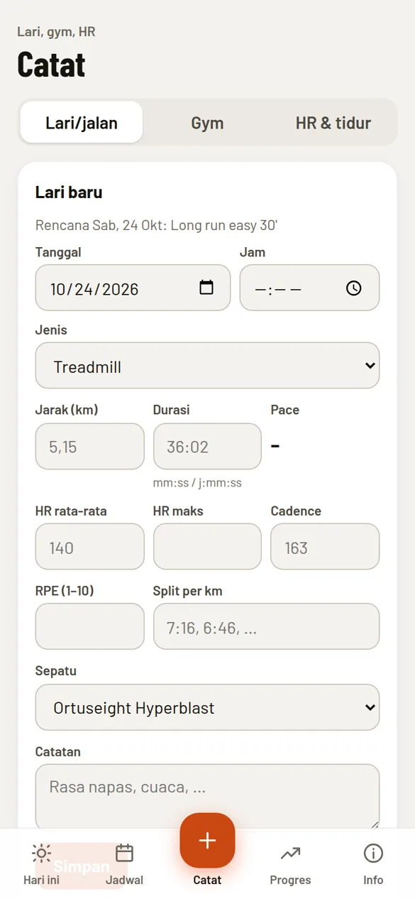
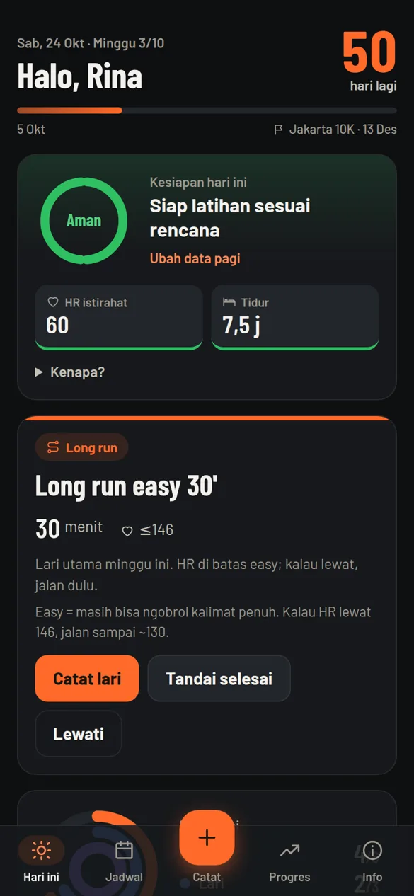
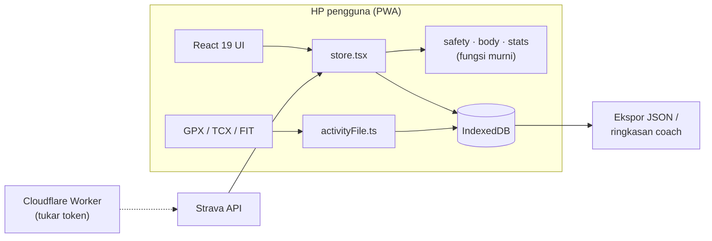

# Rusukaina

[](https://github.com/ibnuasharramadhan/rusukaina/actions/workflows/ci.yml)

**Pelatih lari & gym di saku, yang tahu kapan harus bilang "hari ini jalan santai saja".**
PWA offline-first untuk menjalankan program latihan menuju race: jadwal harian, cek kesiapan pagi,
log lari/gym, impor file jam, grafik progres, dan kartu share. Tanpa server, tanpa akun.

**[Coba langsung →](https://ibnuasharramadhan.github.io/rusukaina/)** · bisa dipasang ke layar utama HP dan jalan tanpa internet.

<p align="center">
  
</p>

<p align="center">
  
  
  
  
</p>

<sub>Screenshot memakai data demo fiktif.</sub>

## Latar belakang

Rusukaina lahir dari kebutuhan nyata: seorang pelari pemula dengan hipertensi terkontrol obat
berlatih menuju race 7K, dengan rencana dari coach dan aturan keamanan yang ketat (batas tensi,
batas HR easy, tidak boleh lari dua hari berturut-turut). Aplikasi lari yang ada mencatat
*apa yang sudah terjadi*; yang dibutuhkan adalah sesuatu yang membaca kondisi pagi ini dan
menyesuaikan *apa yang boleh dilakukan hari ini*.

Setelah dipakai sendiri, aplikasi dibuka untuk beberapa teman lari: mereka mengisi onboarding
singkat dan mendapat rencana yang disusun otomatis dengan aturan yang sama.

## Yang bisa dilakukan

| | |
|---|---|
| **Cek kesiapan pagi** | HR istirahat, tidur, tensi (opsional), nyeri, dan keluhan obat (pusing, batuk kering) → hijau / kuning / merah. Sesi hari ini ikut menyesuaikan, misalnya strides dicoret atau lari diganti jalan santai. |
| **Rencana otomatis** | Onboarding 3 langkah → rencana sampai hari race: long run naik ±10% per minggu, deload tiap minggu ke-4, taper, maks 3 lari per minggu, tidak pernah 2 hari berturut-turut. |
| **Catat** | Lari dan jalan kaki (pace live, zona HR, split, sepatu), Gym A/B dengan saran naik beban, HR istirahat, tidur, dan nyeri. |
| **Impor dari jam** | File **GPX, TCX, FIT** (Garmin, Coros, Huawei, dll.), beberapa sekaligus, atau sinkron otomatis lewat Strava. |
| **Progres** | Konsistensi, HR istirahat, pace, HR saat lari vs batas easy, efisiensi aerobik (meter per detak), km per minggu. Setiap grafik punya tooltip dan tampilan tabel. |
| **Kartu share** | Gambar 4:5 siap IG/WA: jarak, pace, HR, split per km, dan progres menuju race. |
| **Obat** | Pengingat jadwal minum saat aplikasi dibuka, aturan dari dokter, dan minggu pertama obat baru yang otomatis dibuat easy. |
| **Sepatu** | Km per sepatu dan pengingat ganti di 90% batas. |
| **Ringkasan untuk coach** | Teks 7 hari siap tempel ke chat, plus ekspor/impor JSON untuk cadangan dan pindah HP. |

<p align="center">
  
  
  
  
</p>

## Keputusan teknis

**Offline-first tanpa backend.** Semua data ada di IndexedDB perangkat. Untuk fase "beberapa teman"
tidak perlu akun, server, atau biaya. Data health tidak pernah keluar dari HP kecuali pengguna
mengekspornya sendiri. Ekspor/impor menggabungkan data per entri (yang `updatedAt`-nya lebih baru
menang), jadi format ekspor sudah siap dipakai sebagai kontrak data kalau nanti ada sinkron server.

**Aturan keamanan sebagai fungsi murni.** Kesiapan (`src/lib/safety.ts`), nyeri (`src/lib/body.ts`),
dan aturan lari (`src/lib/stats.ts`) adalah fungsi tanpa efek samping yang dites unit. Aturan untuk
hipertensi hanya berlaku bila profil memang minum obat tensi, jadi teman tanpa hipertensi tidak ikut
dibatasi. Nyeri tidak pernah menutupi peringatan tensi kritis.

**Parser FIT tanpa library.** `src/lib/activityFile.ts` membaca format biner FIT langsung
(definition/data message, header timestamp terkompresi, nilai invalid per base type), plus GPX/TCX
lewat XML. Hasilnya hanya ~300 baris dan tidak menambah dependensi.

**Grafik dan kartu share tanpa library.** Grafik SVG buatan sendiri (`src/components/charts.tsx`) dan
kartu share digambar ke `<canvas>` (`src/lib/shareCard.ts`), lalu dibagikan lewat Web Share API
dengan file, atau diunduh sebagai PNG. Seluruh JS ~107 kB gzip, termasuk React.

**Generator rencana yang bisa dibuktikan.** `src/data/generator.ts` menghasilkan jadwal dari jawaban onboarding,
dan tesnya memeriksa invarian untuk berbagai kombinasi: tepat satu sesi per hari, tidak ada lari 2 hari
berturut-turut, maks 3 lari per minggu, kenaikan long run ≤10% (min 5 menit), dan taper lebih pendek
dari puncak.

**Strava tanpa membocorkan secret.** OAuth memakai Cloudflare Worker kecil (`worker/`) hanya untuk
menukar token. Panggilan API berikutnya langsung dari browser. Lihat
[docs/strava-setup.md](docs/strava-setup.md).

**Gerak yang menghormati pengguna.** View Transitions API untuk perpindahan layar, angka yang
menghitung naik, cincin mingguan, dan konfeti saat sesi selesai. Semuanya mati bila
`prefers-reduced-motion` aktif.



## Kualitas

- **91 tes** (Vitest + `fake-indexeddb`): aturan keamanan, generator rencana, parser GPX/TCX/FIT (termasuk file FIT sintetis), sinkron Strava, IndexedDB, dan ekspor/impor.
- **CI di setiap PR**: typecheck, tes, dan build. Deploy ke GitHub Pages otomatis dari `master`.
- **Aksesibilitas**: 0 pelanggaran axe-core di semua layar (terang dan gelap, lebar 360 px). Setiap grafik juga punya tampilan tabel.
- **TypeScript strict** di seluruh kode.

## Teknologi

Vite · React 19 · TypeScript · vite-plugin-pwa (Workbox) · idb · Vitest · GitHub Actions · Cloudflare Workers (opsional, untuk Strava).
Font Barlow di-bundle supaya tetap tampil offline, dan ikonnya SVG buatan sendiri.

## Struktur

```
src/
  data/generator.ts      Rencana otomatis dari jawaban onboarding
  data/presets/ibnu.ts   Rencana dari coach (preset) + revisi per tanggal
  data/plan.ts           Rencana aktif: plan(), sessionOn(), weekOf()
  data/gym.ts            Program Gym A/B
  lib/safety.ts          Kesiapan: tensi, HR istirahat, tidur (+ nyeri)
  lib/body.ts            Aturan nyeri, km sepatu
  lib/stats.ts           Status sesi, statistik, aturan lari, ringkasan coach
  lib/activityFile.ts    Parser GPX / TCX / FIT
  lib/shareCard.ts       Kartu share (canvas)
  lib/strava.ts          OAuth + sinkron Strava
  lib/db.ts              IndexedDB, ekspor/impor
  lib/motion.ts          View Transitions, hitung naik, konfeti
  pages/                 Today, Schedule, Log, Progress, Info, Onboarding
  components/            UI, grafik, kartu sepatu, lembar share
worker/                  Cloudflare Worker untuk token Strava
```

## Menjalankan

```bash
npm install
npm run dev        # http://localhost:5173
npm test           # vitest
npm run build      # dist/ (termasuk sw.js dan manifest)
npm run preview    # uji build + service worker
```

Untuk memasang di HP: buka URL deploy, lalu pilih **Android/Chrome:** menu ⋮ › *Tambahkan ke layar utama*,
atau **iPhone/Safari:** Bagikan › *Tambah ke Layar Utama*.

Format ekspor (`schemaVersion: 1`):
```json
{ "app": "pwa-latihan", "schemaVersion": 1, "exportedAt": "...",
  "profile": {}, "runs": [], "daily": [], "gym": [], "marks": [], "shoes": [] }
```

## Rencana berikutnya

- Masukan dari pemakaian bersama teman lari (sedang berjalan).
- Fase publik: akun dan sinkron antar perangkat (mis. Supabase atau Cloudflare D1), notifikasi push, review aplikasi Strava.
- Penyesuaian jadwal otomatis bila sesi terlewat atau HR terus tinggi.

> Rusukaina adalah alat bantu catatan latihan, bukan alat medis. Konsultasikan kondisi kesehatan dengan dokter.

## Lisensi

MIT
